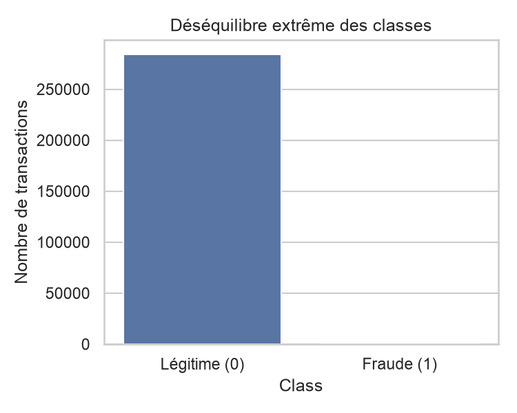
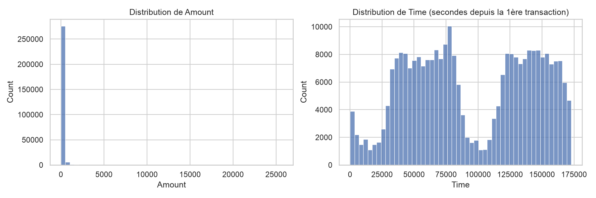
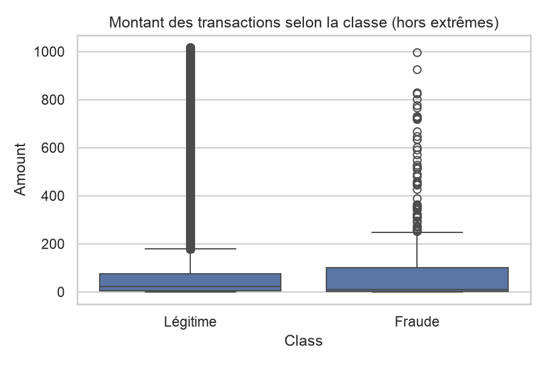
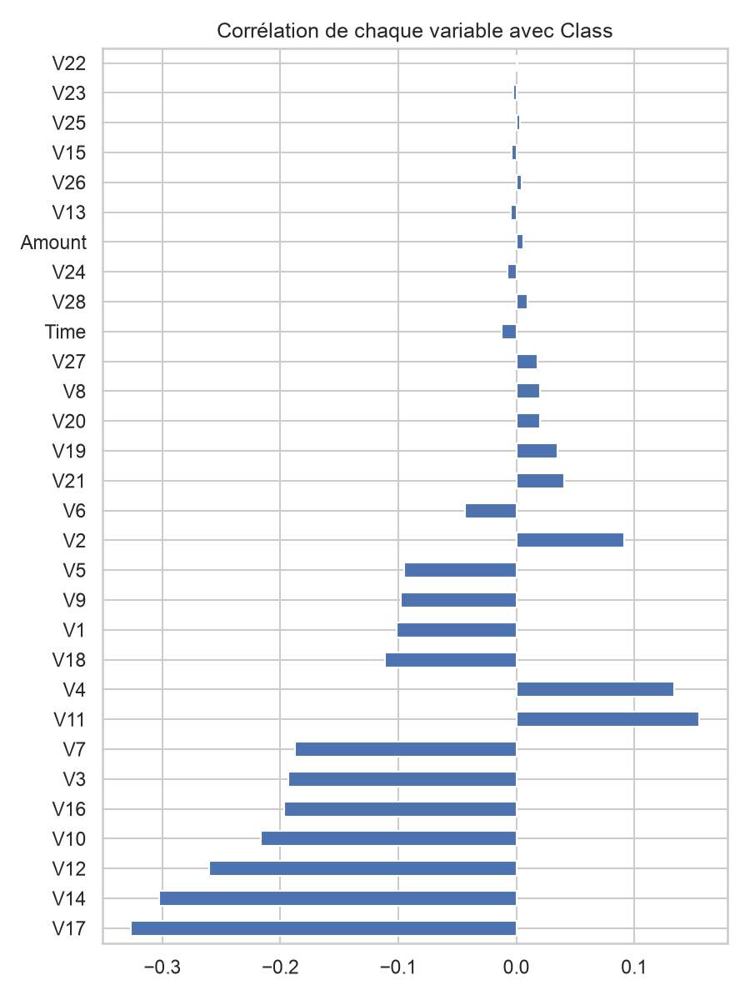
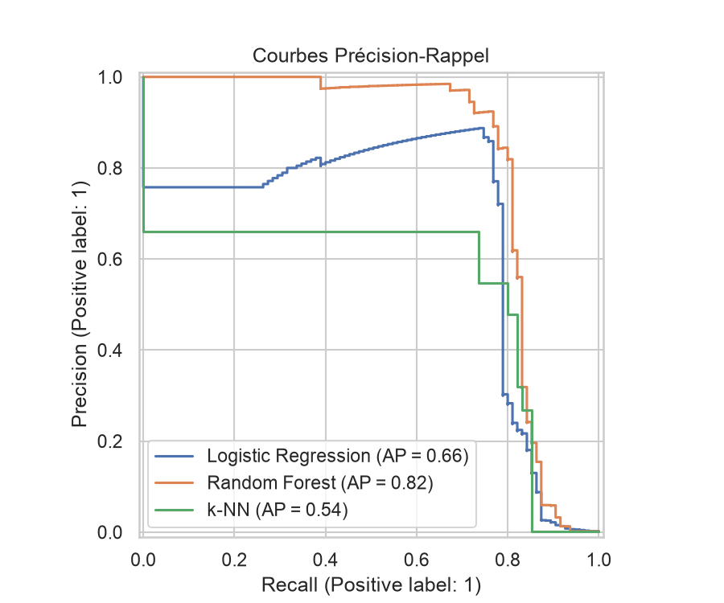
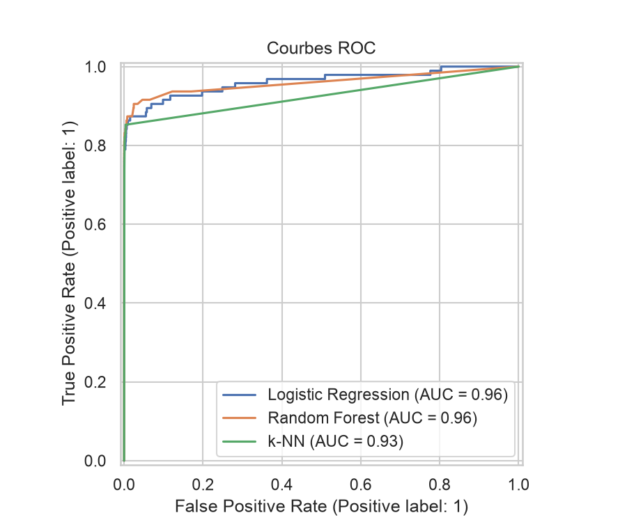
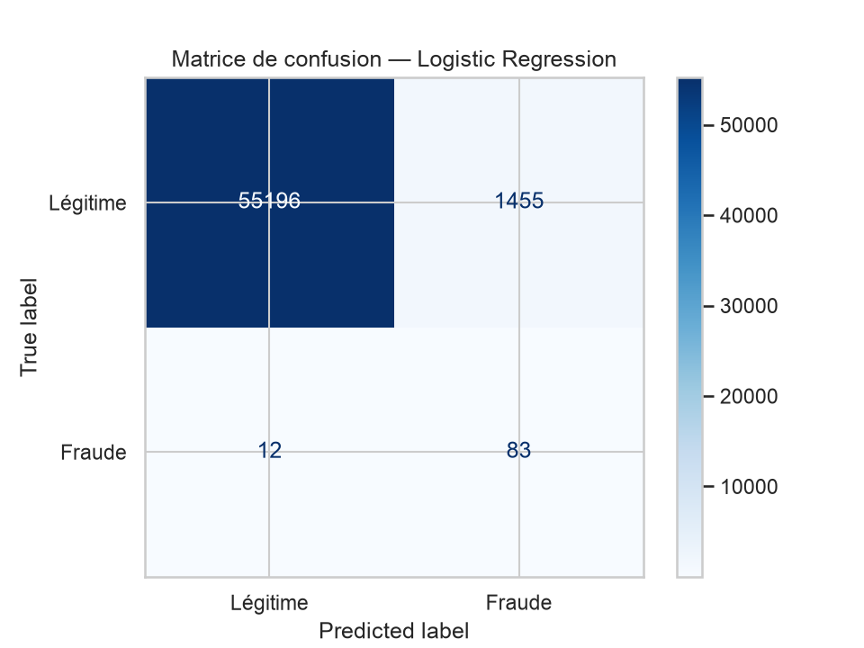
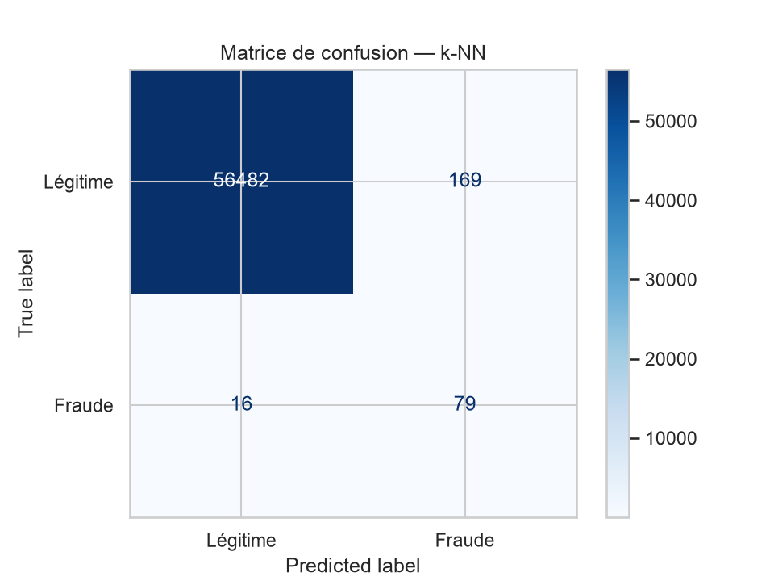
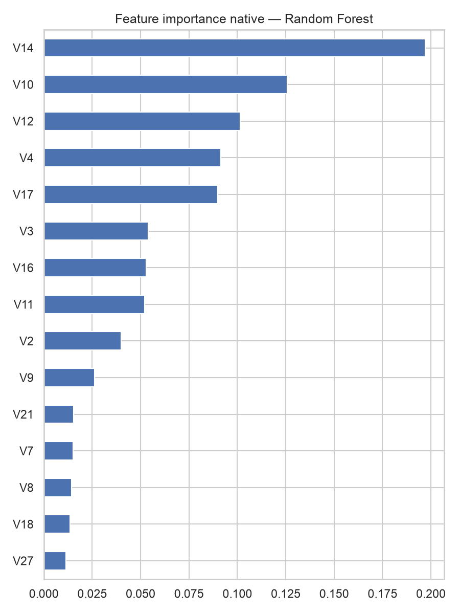
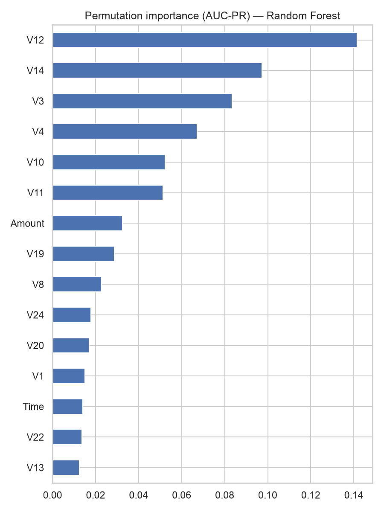

# 1. Introduction et contexte

La fraude par carte de crédit représente une perte financière directe pour les émetteurs de cartes et une atteinte à la confiance des porteurs. Sa détection automatique pose un problème de classification binaire particulièrement difficile : les transactions frauduleuses sont extrêmement rares (de l'ordre de 0,1 à 0,2 % du volume), ce qui rend les métriques usuelles (exactitude, AUC-ROC seule) trompeuses et impose un protocole d'évaluation et de prétraitement spécifique.

Ce projet compare trois familles de modèles supervisés — régression logistique régularisée, forêt aléatoire, k plus proches voisins — sur le jeu de données public *Credit Card Fraud Detection* (Kaggle / Université Libre de Bruxelles), avec pour objectif de maximiser la détection des fraudes tout en maîtrisant le volume de fausses alertes, dans un cadre méthodologique rigoureux (absence de fuite de données, validation croisée stratifiée, métriques adaptées au déséquilibre).

L'ensemble du pipeline (EDA, prétraitement, modélisation, évaluation, interprétabilité) est implémenté dans un notebook Jupyter unique et reproductible (`notebooks/fraud_detection.ipynb`), dont ce rapport synthétise la démarche et les résultats.

# 2. Jeu de données et analyse exploratoire (EDA)

## 2.1 Description

Le jeu de données contient 284 807 transactions bancaires réalisées par des porteurs de cartes européens en septembre 2013, dont 492 sont frauduleuses, soit **0,17 % du volume total**. Il comprend :

- `Time` : nombre de secondes écoulées depuis la première transaction de l'échantillon.
- `Amount` : montant de la transaction.
- `V1` à `V28` : 28 variables anonymisées, résultat d'une Analyse en Composantes Principales (ACP) appliquée en amont par les auteurs du dataset — elles sont donc déjà centrées-réduites et décorrélées entre elles.
- `Class` : variable cible (0 = légitime, 1 = fraude).

Aucune valeur manquante n'a été détectée sur l'ensemble des colonnes.

## 2.2 Déséquilibre de classes

{width=55%}

Le déséquilibre extrême (1 fraude pour ~578 transactions légitimes) est le point structurant de tout le reste de la méthodologie : un modèle trivial qui prédit systématiquement « non-fraude » atteindrait 99,83 % d'exactitude tout en étant totalement inutile. Cela justifie :

- l'usage de l'AUC-PR (aire sous la courbe précision-rappel) plutôt que l'exactitude ou l'AUC-ROC seule comme métrique de sélection de modèle (section 4) ;
- le recours à un rééchantillonnage (SMOTE) pendant l'entraînement (section 3).

## 2.3 Distributions et corrélations

{width=55%}

{width=55%}

{width=55%}

- La variable `Amount` est fortement asymétrique (nombreuses petites transactions, quelques montants très élevés) ; les transactions frauduleuses ne se distinguent pas nettement par leur montant médian, mais présentent une distribution différente (moins de très gros montants).
- `Time` ne montre pas de tendance exploitable directement en l'état (elle encode un temps écoulé sur ~2 jours, sans information calendaire explicite type heure de la journée).
- La corrélation univariée de chaque variable ACP avec `Class` fait ressortir un sous-ensemble de variables (notamment celles avec la plus forte valeur absolue de corrélation) potentiellement les plus discriminantes ; cette lecture univariée reste toutefois limitée puisqu'elle ignore les interactions entre variables, ce que les modèles multivariés (section 3) captent en partie.

## 2.4 Doublons

L'EDA a révélé **1 081 lignes strictement dupliquées** (mêmes valeurs sur toutes les colonnes, `Class` incluse). Ce point est traité comme un problème méthodologique à part entière plutôt qu'un simple nettoyage cosmétique : si des doublons se répartissent entre les ensembles d'entraînement et de test après le split, le modèle peut être évalué sur des exemples qu'il a, de fait, déjà vus à l'identique pendant l'entraînement — une forme indirecte de fuite de données qui gonflerait artificiellement les métriques de test. Les doublons sont donc supprimés (`drop_duplicates`) **avant** le split train/test (section 3.1), ramenant le jeu de données à 283 726 lignes (473 fraudes, soit toujours ~0,17 %). L'effet mesuré de ce correctif sur les métriques finales est quantifié en section 8.2.

# 3. Prétraitement et prévention de la fuite de données (« data leakage »)

La prévention de la fuite de données structure l'ordre des opérations du notebook, dans cet ordre strict :

1. **Suppression des doublons** sur l'intégralité du jeu de données (avant tout split — les doublons ne dépendent pas du split, leur retrait en amont est donc sans risque de fuite).
2. **Split train/test stratifié** sur `Class` (80/20, `random_state=42` fixé une fois pour tout le notebook et réutilisé partout pour la reproductibilité), *avant* toute étape d'apprentissage statistique (normalisation, rééchantillonnage).
3. **Normalisation** : seules `Time` et `Amount` sont standardisées (moyenne 0, écart-type 1) via `StandardScaler` ; `V1`–`V28` ne sont pas retouchées car déjà issues d'une ACP en amont. Le `scaler` est **ajusté (`fit`) uniquement sur les données d'entraînement**, puis appliqué (`transform`) tel quel sur les données de test — les statistiques du test n'influencent jamais l'apprentissage.
4. **Rééchantillonnage (SMOTE)** : plutôt que d'appliquer SMOTE une fois sur l'ensemble d'entraînement avant la validation croisée, chaque modèle est encapsulé dans un `imblearn.pipeline.Pipeline` avec SMOTE comme première étape. Cela garantit que le rééchantillonnage est recalculé **à l'intérieur de chaque pli de validation croisée**, sur les seules données d'entraînement du pli — aucune donnée du pli de validation, même indirectement via des voisins synthétiques, n'entre dans le calcul des exemples synthétiques.

Ce dernier point est le mécanisme central attendu par la consigne de l'énoncé sur l'absence de fuite de données : un pipeline `scikit-learn`/`imblearn` unique par modèle, où SMOTE fait partie intégrante des étapes re-fit à chaque pli, plutôt qu'un pré-traitement global appliqué une seule fois en amont de la validation croisée.

# 4. Modélisation : trois familles comparées

Trois familles de modèles aux biais inductifs différents sont comparées sur un protocole strictement identique (mêmes données d'entrée, même schéma de validation croisée, même métrique de sélection) :

| Famille | Modèle | Justification |
|---|---|---|
| Linéaire régularisé | Régression logistique (`LogisticRegression`) | Modèle de référence, interprétable (coefficients), rapide, sert de baseline linéaire. |
| Ensembliste à base d'arbres | Forêt aléatoire (`RandomForestClassifier`) | Capture les interactions non linéaires entre variables sans hypothèse de linéarité, robuste au bruit, fournit une importance de variable native. |
| Instance-based | k plus proches voisins (`KNeighborsClassifier`) | Approche non paramétrique de nature différente des deux précédentes (ni linéaire, ni ensembliste), utile comme troisième point de comparaison malgré sa sensibilité connue à la dimensionnalité. |

Chaque modèle est intégré dans un pipeline `imblearn` : `SMOTE → StandardScaler (déjà appliqué en amont pour Time/Amount) → Classifieur`, garantissant que le rééchantillonnage est traité comme une étape d'apprentissage à part entière (section 3).

# 5. Sélection de modèle et recherche d'hyperparamètres

## 5.1 Protocole

- **Validation croisée** : `StratifiedKFold` à 5 plis (`shuffle=True`, `random_state=42`), stratifiée sur `Class` pour garantir une proportion de fraudes comparable dans chaque pli malgré le déséquilibre extrême.
- **Recherche d'hyperparamètres** : `RandomizedSearchCV` par modèle (8 combinaisons tirées aléatoirement pour Random Forest et k-NN ; l'espace de recherche de la régression logistique étant restreint à 5 valeurs de `C`, les 5 combinaisons sont testées de façon exhaustive).
- **Métrique de sélection** : `average_precision` (aire sous la courbe précision-rappel, AUC-PR). Ce choix est délibéré : avec 0,17 % de positifs, l'AUC-ROC reste artificiellement élevée même pour un modèle médiocre (le grand nombre de vrais négatifs domine le calcul), alors que l'AUC-PR est beaucoup plus sensible à la capacité réelle du modèle à isoler les rares positifs.

## 5.2 Espaces de recherche

| Modèle | Hyperparamètres testés |
|---|---|
| Régression logistique | `C` ∈ {0.01, 0.1, 1, 10, 100} |
| Random Forest | `n_estimators` ∈ {100, 200, 300}, `max_depth` ∈ {None, 10, 20, 30}, `min_samples_leaf` ∈ {1, 2, 5} |
| k-NN | `n_neighbors` ∈ {3, 5, 7, 11} |

# 6. Évaluation

## 6.1 Comparaison des modèles sur le jeu de test tenu à l'écart

| Modèle | AUC-PR (test) | AUC-ROC (test) | Précision | Rappel | AUC-PR (CV, meilleur pli) | Variance CV (± écart-type AUC-PR) |
|---|---|---|---|---|---|---|
| Random Forest | **0.818** | **0.960** | 89.2 % | 77.9 % | 0.844 | ± 0.032 |
| Régression logistique | 0.659 | 0.962 | 5.4 % (seuil 0.5) | 87.4 % | 0.754 | ± 0.026 |
| k-NN | 0.540 | 0.926 | 31.9 % | 83.2 % | 0.612 | ± 0.024 |

{width=55%}

{width=55%}

**Random Forest** est le modèle retenu : meilleur AUC-PR de loin (0.818 contre 0.659 et 0.540), et le meilleur compromis précision/rappel au seuil par défaut (0.5). Sa variance entre plis de validation croisée (± 0.032) est en réalité la plus élevée des trois modèles (voir section 6.3) — la sélection repose donc ici sur la performance moyenne plutôt que sur un avantage de stabilité, une nuance assumée dans la discussion critique (section 8).

## 6.2 Détail de la matrice de confusion (Random Forest, jeu de test)

{width=55%}

Sur les 95 fraudes présentes dans le jeu de test dédoublonné (20 % de 473 fraudes, sur un total de 56 746 transactions de test) :

- **74 vrais positifs** : fraudes correctement détectées (rappel = 77,9 %).
- **21 faux négatifs** : fraudes non détectées — le coût métier le plus élevé (perte financière directe non couverte).
- **9 faux positifs** sur 56 651 transactions légitimes : transactions bloquées à tort (précision = 89,2 %).
- **56 642 vrais négatifs**.

Pour comparaison, les matrices de confusion des deux autres modèles :

{width=55%}

{width=55%}

## 6.3 Stabilité entre plis de validation croisée

La variance des scores AUC-PR entre les 5 plis de validation croisée est rapportée pour chaque modèle (± écart-type) : k-NN (± 0.024) et la régression logistique (± 0.026) sont en réalité plus stables que Random Forest (± 0.032) une fois les doublons retirés — un résultat qui inverse ce qu'on observait avant correction du biais de doublons (section 8.2). Random Forest reste néanmoins le modèle retenu car son score moyen (0.844) domine largement les deux autres, mais cette variance plus élevée est documentée comme une limite du choix plutôt que masquée.

# 7. Interprétabilité

{width=55%}

{width=55%}

Deux approches complémentaires sont utilisées pour expliquer le modèle retenu (Random Forest) :

- **Importance native (`feature_importances_`)** : mesure directement issue de la structure des arbres (réduction moyenne d'impureté par variable), rapide à calculer mais potentiellement biaisée en faveur des variables à forte cardinalité.
- **Importance par permutation**, calculée sur un sous-échantillon de 5 000 lignes du jeu de test (pour limiter le temps de calcul) et scorée sur `average_precision` plutôt que l'exactitude, cohérent avec le choix de métrique du reste du projet — elle mesure la dégradation de performance réelle quand une variable est aléatoirement permutée, donc moins sensible au biais de cardinalité que l'importance native.

L'importance native fait ressortir en tête `V12`, `V14`, `V3`, `V4`, `V10` ; l'importance par permutation fait ressortir `V14`, `V10`, `V12`, `V4`, `V17`. Les deux approches convergent largement sur le même sous-ensemble (`V4`, `V10`, `V12`, `V14`), ce qui renforce la confiance dans le signal retenu par le modèle plutôt qu'un artefact de la méthode d'importance choisie.

L'usage de SHAP (valeurs de Shapley), mentionné comme piste optionnelle dans le notebook, n'a pas été mis en œuvre par manque de temps — c'est une limite explicite de ce travail (voir section 8).

# 8. Discussion critique, limites et biais

## 8.1 Limites du modèle retenu et cas d'erreur

- Les 21 fraudes manquées (faux négatifs) restent le point faible principal : elles représentent le risque financier direct le plus élevé et ne sont pas rattrapées par le seuil de décision actuel.
- Les 9 faux positifs, sur 56 651 transactions légitimes, représentent un coût opérationnel très faible (peu de vérifications manuelles déclenchées à tort) — la précision de 89,2 % laisse une marge confortable pour ajuster le seuil de décision (voir ci-dessous).
- **Aucun seuil de décision alternatif n'a été calibré** : les prédictions utilisent `predict()`, donc un seuil implicite de 0.5. Or, dans ce contexte métier, un faux négatif coûte structurellement plus cher qu'un faux positif (perte financière directe vs. coût de vérification) — cela justifierait, en production, d'abaisser le seuil pour privilégier le rappel, au prix d'un volume plus élevé de fausses alertes. Les courbes précision-rappel (section 6) permettent ce choix une fois un coût métier explicite défini, mais ce calibrage n'a pas été fait ici.
- Logistic Regression et k-NN, au seuil par défaut, illustrent ce compromis de façon plus extrême : la régression logistique atteint un rappel élevé (87.4 %) mais une précision très faible (5.4 %), la rendant inutilisable telle quelle en production sans recalibrage.

## 8.2 Biais et représentativité du jeu de données

- **Fenêtre temporelle étroite** : transactions européennes de septembre 2013 uniquement (environ 2 jours) — aucune représentativité vis-à-vis des patterns de fraude actuels (carding automatisé, fraude assistée par IA générative, etc.) ni de la diversité géographique/réglementaire hors zone euro.
- **Anonymisation par ACP** (`V1`–`V28`) : protège la confidentialité des données bancaires réelles mais empêche toute vérification de biais liés à des variables métier explicites (pays, type de commerçant, catégorie d'achat) et limite l'ingénierie de nouvelles variables métier.
- **Doublons exacts, et effet mesuré de leur correction** : 1 081 lignes strictement dupliquées ont été détectées en EDA et retirées avant le split (section 2.4/3). Un premier passage complet du pipeline, effectué avant ce correctif, donnait des métriques sensiblement plus optimistes pour Random Forest : AUC-PR test = 0.873 (contre 0.818 après correction), rappel = 83,7 % (contre 77,9 %), précision = 75,9 % (contre 89,2 %). Ce contraste illustre concrètement le risque de fuite de données par doublons répartis entre train et test — une partie de la performance apparente du premier passage reposait sur des exemples déjà mémorisés à l'identique par le modèle. La baisse du rappel et la hausse de la précision après correction ne remettent pas en cause le choix de Random Forest, mais donnent une estimation plus honnête de sa performance réelle en généralisation.
- **Dérive de concept (« concept drift »)** : un déploiement en production sur des données actuelles nécessiterait un ré-entraînement régulier et une surveillance de la dérive de performance dans le temps, ce qui dépasse le cadre de ce projet académique.

## 8.3 Pistes d'amélioration concrètes

- Calibrer le seuil de décision sur la courbe précision-rappel en fonction d'un coût métier explicite (coût moyen d'une fraude non détectée vs. coût moyen d'une vérification manuelle), plutôt que d'utiliser le seuil par défaut de 0.5 — d'autant plus pertinent ici vu la marge de précision dégagée par Random Forest.
- Étendre la recherche d'hyperparamètres de Random Forest : l'espace testé ici est restreint (8 combinaisons parmi 3×4×3 valeurs possibles) ; un `GridSearchCV` plus large ou une recherche bayésienne (Optuna) pourrait affiner davantage le compromis biais/variance, d'autant que la variance inter-plis mesurée ici (± 0.032) est la plus élevée des trois modèles.
- Ajouter un modèle de gradient boosting (XGBoost, déjà présent dans les dépendances du projet) comme point de comparaison supplémentaire, potentiellement plus performant que Random Forest sur ce type de données tabulaires déséquilibrées.
- Compléter l'interprétabilité par des valeurs de Shapley (SHAP) pour illustrer des cas individuels (une fraude détectée, une fraude manquée), au-delà de la seule importance agrégée des variables.

# 9. Conclusion

Sur ce jeu de données extrêmement déséquilibré, la forêt aléatoire offre le meilleur AUC-PR (0.818) et le meilleur compromis précision/rappel (89,2 % / 77,9 %) parmi les trois familles de modèles comparées, au seuil par défaut. Sa variance entre plis de validation croisée (± 0.032) est en réalité la plus élevée des trois modèles — un résultat assumé et documenté plutôt que lissé. Le protocole méthodologique — split avant tout apprentissage statistique, rééchantillonnage SMOTE intégré au pipeline de validation croisée, métrique adaptée au déséquilibre (AUC-PR), suppression des doublons avant le split — garantit l'absence de fuite de données à chaque étape ; l'effet mesuré de la correction du biais de doublons (section 8.2) illustre d'ailleurs concrètement pourquoi cette rigueur méthodologique compte. Les limites les plus significatives — absence de calibrage de seuil, fenêtre temporelle et anonymisation restreignant la représentativité du jeu de données — sont documentées explicitement (section 8) plutôt que masquées, conformément à l'exigence d'analyse critique honnête de ce projet.

# 10. Utilisation d'outils d'IA

Voir la section dédiée du `README.md` du dépôt pour le détail des tâches assistées par IA (Claude Code) durant ce projet : mise en place de l'environnement, exécution de bout en bout du notebook pour validation, et rédaction d'un premier jet des sections d'analyse critique et de ce rapport à partir des résultats réellement produits par le notebook. Les choix de modèles, la stratégie de prétraitement, les métriques d'évaluation et les hyperparamètres testés proviennent du notebook original, écrit avant toute assistance IA.

# Références

- Dal Pozzolo, A., Caelen, O., Johnson, R. A., Bontempi, G. (2015). *Calibrating Probability with Undersampling for Unbalanced Classification*. Symposium on Computational Intelligence and Data Mining (CIDM), IEEE.
- Chawla, N. V., Bowyer, K. W., Hall, L. O., Kegelmeyer, W. P. (2002). *SMOTE: Synthetic Minority Over-sampling Technique*. Journal of Artificial Intelligence Research, 16, 321-357.
- Pedregosa, F. et al. (2011). *Scikit-learn: Machine Learning in Python*. Journal of Machine Learning Research, 12, 2825-2830.
- Jeu de données : [Credit Card Fraud Detection](https://www.kaggle.com/mlg-ulb/creditcardfraud), Kaggle / Université Libre de Bruxelles (ULB).
